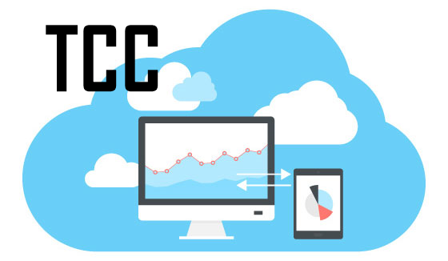

<!-- PROJECT LOGO -->
<h1 align="center">
   
  
   
  Final Project - Electrical Engineer
   
</h1>

<h4 align="center">
  🧾 Cloud-based intelligent system for hydraulic pump failure detection.
</h4>

<!-- PROJECT SHIELDS -->

  
  
  
  
  

<!-- TABLE OF CONTENTS -->

  
<b>Table of Contents</b>

          <a href="#about-the-project">About The Project</a> |
          <a href="#getting-started">Getting Started</a> |
          <a href="#quick-guide">Quick Guide</a> |
          <a href="#contributing">Contributing</a> |
          <a href="#license">License</a> |
          <a href="#contact">Contact</a>

## About the Project

Intelligent equipment failure diagnosis systems are essential in industries to prevent failures, reduce downtime and increase plant availability. In this context, this work proposes a methodology for the development of an intelligent cloud-based system for detecting anomalies and identifying failures in a piping system due to malfunctioning pumps, such as cavitation. Relevant information is extracted based on the electrical current of the motor, available in the OPC UA server of the S7-1200 controller. A prototype of a hydraulic piping system was used for data collection and methodology validation. Machine learning tools to extract and select features (such as standard deviation, entropy, signal harmonics, etc.) and an SVM-based model developed in the Node-RED pattern recognition tool are used to diagnose the status of the centrifugal pump. The results achieved were 81.66% accuracy for cavitation failure detection and 100% for dry operation, with an average cloud classification response time of approximately 35.14 ms. Thus, the methodology is feasible and efficient, indicating an opportunity to improve the use and availability of data coming from the engine by intelligent relays, and the performance of information retrieval from industrial network communication.

## Getting Started

## Presentation

This project was presented to a panel of doctors and engineers and is available for access at the following link:

[Google Drive - Apresentação TCC - CloudComputing](https://drive.google.com/file/d/1-q3eH92pAjtBhJ_9P_Q8aBZSZsS9M6MM/view?usp=sharing)

And the presentation file is available in this repository and can be accessed by clicking on the following image:

![presentation][presentation]

## Contributing

If you want to contribute to this project and make it better, your help is very welcome.

**How to make a clean pull request**

Look for a project's contribution instructions. If there are any, follow them.

- Create a personal fork of the project on Github.
- Clone the fork on your local machine. Your remote repo on Github is called `origin`.
- Add the original repository as a remote called `upstream`.
- If you created your fork a while ago be sure to pull upstream changes into your local repository.
- Create a new branch to work on! Branch from `develop` if it exists, else from `main`.
- Implement/fix your feature, comment your code.
- Follow the code style of the project, including indentation.
- If the project has tests run them!
- Write or adapt tests as needed.
- Add or change the documentation as needed.
- Squash your commits into a single commit with git's [interactive rebase](https://www.atlassian.com/br/git/tutorials/rewriting-history/git-rebase). Create a new branch if necessary.
- Push your branch to your fork on Github, the remote `origin`.
- From your fork open a pull request in the correct branch. Target the project's `develop` branch if there is one, else go for `main`!
- Once the pull request is approved and merged you can pull the changes from `upstream` to your local repo and delete
your extra branch(es).

> Always write your commit messages in the present tense. Your commit message should describe what the commit, when applied, does to the code – not what you did to the code.

<!-- MIT License -->

## License

Distributed under the MIT License. See [LICENSE](https://github.com/JonathanTSilva/FP-CloudCavitation/blob/main/LICENSE) for more information.

## Contact
[Jonathan T. da Silva](https://www.linkedin.com/in/JonathanTSilva/) - jonathan.t@aluno.ifsp.edu.br  
Project Link: [JonathanTSilva/FP-CloudCavitation](https://github.com/JonathanTSilva/FP-CloudCavitation)

<!-- MARKDOWN LINKS & IMAGES -->
<!-- Caso utilize as imagens em markdown, sempre seguir este padrão!-->
<!--
[![Contributors][contributors-shield]][contributors-url]
[![Forks][forks-shield]][forks-url]
[![Stargazers][stars-shield]][stars-url]
[![Issues][issues-shield]][issues-url]
[![MIT License][license-shield]][license-url]
[![LinkedIn][linkedin-shield]][linkedin-url]
[presentation]: https://github.com/JonathanTSilva/FP-CloudCavitation/blob/main/Images/presentation1.png
-->

<!-- https://www.markdownguide.org/basic-syntax/#reference-style-links -->
<!--
[contributors-shield]: https://img.shields.io/github/contributors/JonathanTSilva/FP-CloudCavitation.svg?style=for-the-badge
[contributors-url]: https://github.com/JonathanTSilva/FP-CloudCavitation/graphs/contributors
[forks-shield]: https://img.shields.io/github/forks/JonathanTSilva/FP-CloudCavitation.svg?style=for-the-badge
[forks-url]: https://github.com/JonathanTSilva/FP-CloudCavitation/network/members
[stars-shield]: https://img.shields.io/github/stars/JonathanTSilva/FP-CloudCavitation.svg?style=for-the-badge
[stars-url]: https://github.com/JonathanTSilva/FP-CloudCavitation/stargazers
[issues-shield]: https://img.shields.io/github/issues/JonathanTSilva/FP-CloudCavitation.svg?style=for-the-badge
[issues-url]: https://github.com/JonathanTSilva/FP-CloudCavitation/issues
[license-shield]: https://img.shields.io/github/license/JonathanTSilva/FP-CloudCavitation.svg?style=for-the-badge
[license-url]: https://github.com/JonathanTSilva/FP-CloudCavitation/blob/main/LICENSE
[linkedin-shield]: https://img.shields.io/badge/-LinkedIn-black.svg?style=for-the-badge&logo=linkedin&colorB=555
[linkedin-url]: https://www.linkedin.com/in/JonathanTSilva/
-->
<!-- [product-screenshot]: -->
